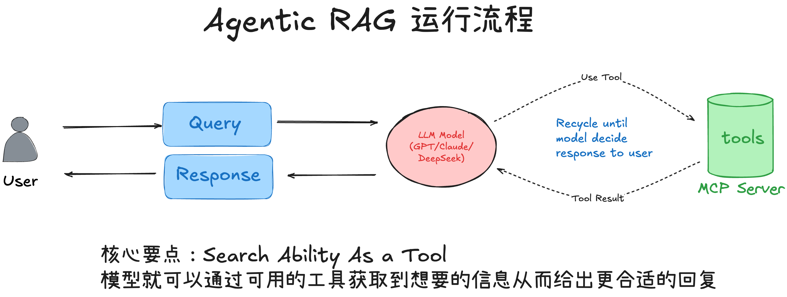
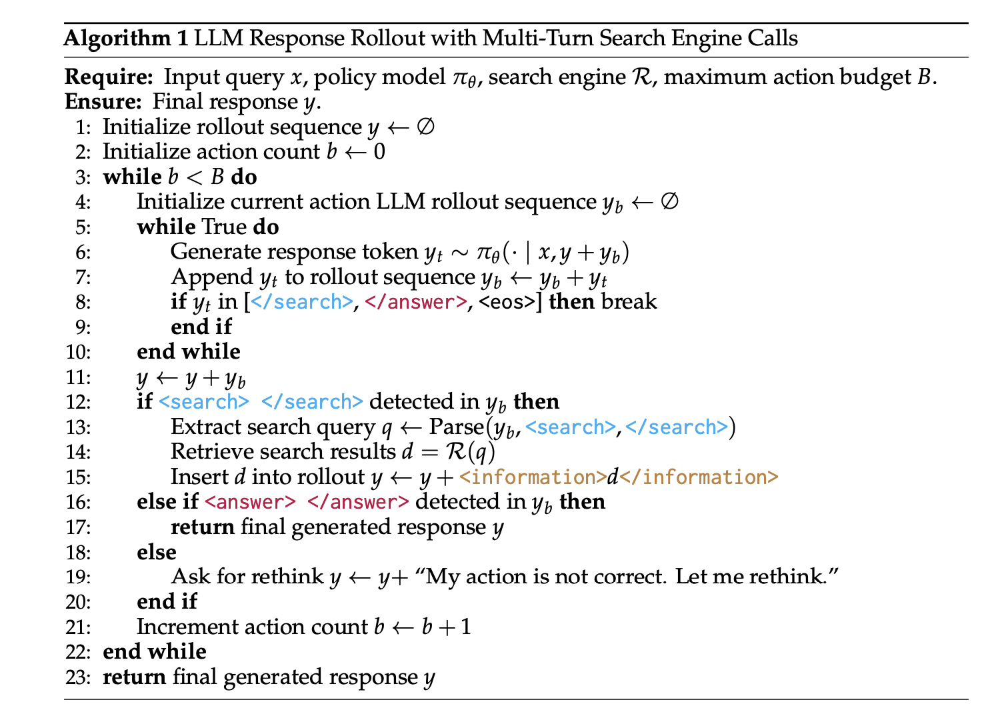
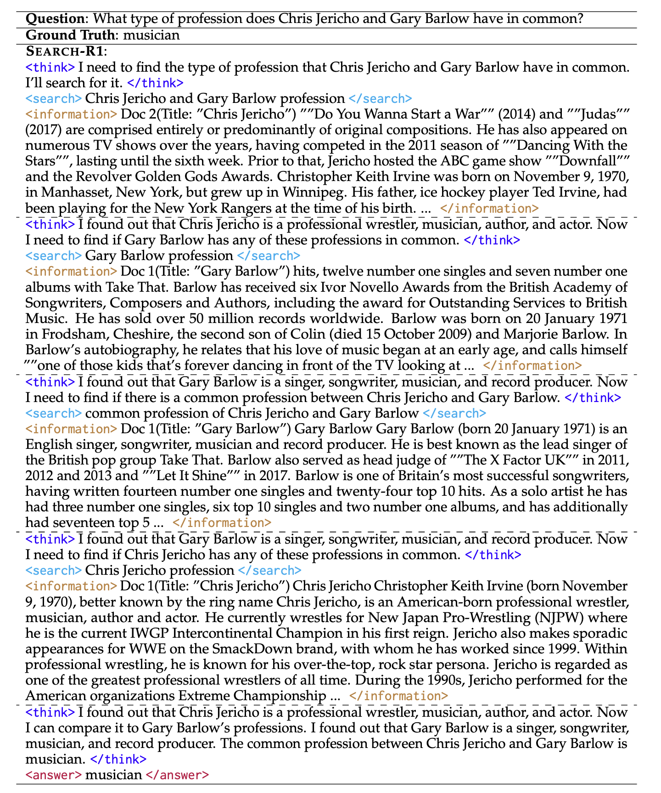

## Summary
[[YuanChaofa]] explains [[RetrievalAugmentedGeneration]] as a fixed offline-ingestion and online-retrieval pipeline, then defines [[AgenticRAG]] by placing model-directed search, reading, and query revision inside an iterative tool loop. The article uses [[Chatbox]] to show a prompt-and-tool implementation that moves from candidate discovery to file metadata and chunk-level reading, and [[SearchR1]] to show how [[ReinforcementLearning]] can train the search policy rather than encode it only in prompts. The retained diagrams make the control boundaries, fallback branches, bounded multi-turn rollout, and evidence-return path explicit.

## Key Claims
- Traditional [[RetrievalAugmentedGeneration]] separates offline document loading, splitting, embedding, and storage from online query embedding, retrieval, context assembly, and generation.

- [[AgenticRAG]] makes search a tool under model control, allowing repeated reason-act-observe cycles, query rewriting, fallback exploration, and evidence gathering before the final response.

- [[Chatbox]] implements two retrieval paths: tool-capable models can choose among semantic search, file listing, metadata inspection, and chunk reading, while models without tool calling use an LLM routing prompt followed by semantic search, optional reranking, and augmented generation.

- A coarse-to-fine retrieval policy first finds candidate files or chunks, inspects metadata where useful, then reads a small number of exact chunks so the answer can cite evidence actually observed by the model.
- [[SearchR1]] uses [[ReinforcementLearning]] to teach a model when to search, what query to issue, and how to continue reasoning from returned evidence instead of relying entirely on hand-written prompt rules.

- Search-R1 represents search and answer actions with explicit tags, enforces a maximum action budget, inserts retrieved information into the rollout, and asks the model to rethink malformed actions before continuing.

- A worked Search-R1 trajectory repeatedly searches two people, compares their retrieved professions, and answers only after identifying the shared profession, illustrating interleaved reasoning and retrieval rather than a single top-k lookup.

## Key Quotes
> "Agentic RAG 的核心不是更复杂的模型，而是让模型学会做事。" - on agency as retrieval control rather than model size.

> "先粗后细" - the article's compact retrieval strategy.

> "何时搜索、搜索什么以及如何利用搜索结果" - the decisions Search-R1 is intended to learn.

## Connections
- [[YuanChaofa]] - author explaining the progression from fixed RAG to tool- and learning-driven retrieval.
- [[RetrievalAugmentedGeneration]] - baseline offline and online pipeline against which the agentic variants are compared.
- [[AgenticRAG]] - central pattern of model-directed, iterative evidence retrieval.
- [[Chatbox]] - production-oriented example of prompt routing, file-aware tools, semantic search, and chunk reading.
- [[SearchR1]] - reinforcement-learning framework for interleaving reasoning and multi-turn search.
- [[ReinforcementLearning]] - optimization method used to learn retrieval behavior from answer-level reward.
- [[LangChain]] - framework used in the article's traditional RAG example.
- LangGraph - framework used to assemble the ReAct-style tool agent example.

## Contradictions
- The source expands the wiki's earlier codebase-centered [[AgenticRAG]] account into a general document-search pattern; it does not contradict the code-specific evidence but shows that semantic search, metadata inspection, and chunk reading can remain useful inside the agent loop.
- The comparison table ranks RL-based Agentic RAG as more adaptive than prompt-based Agentic RAG, but the article provides tutorial examples rather than a controlled benchmark and explicitly notes higher training cost and data dependence.
