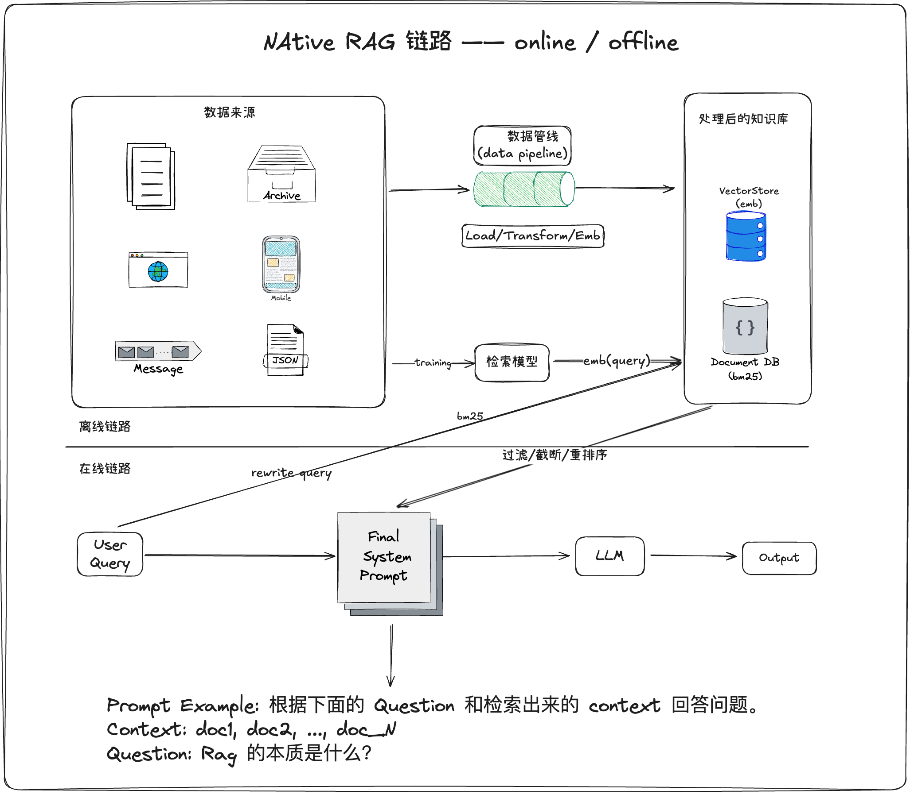
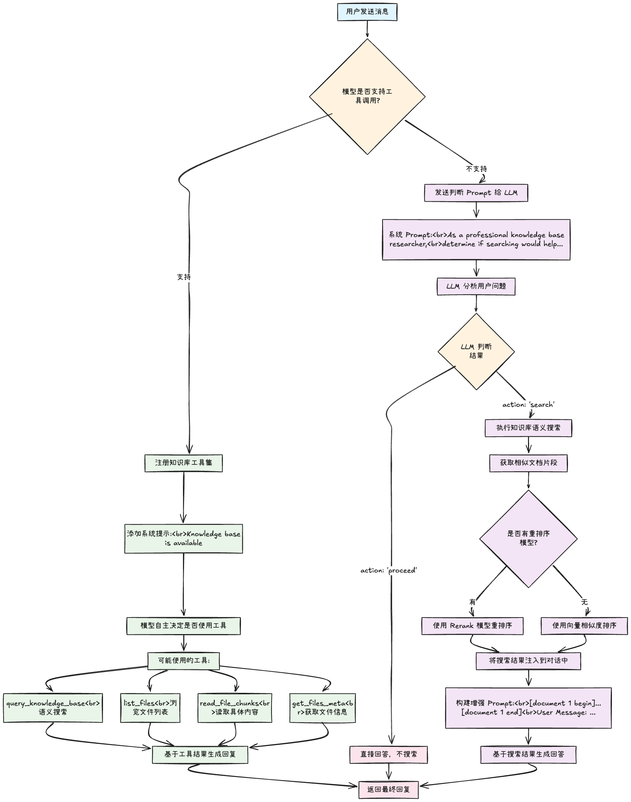
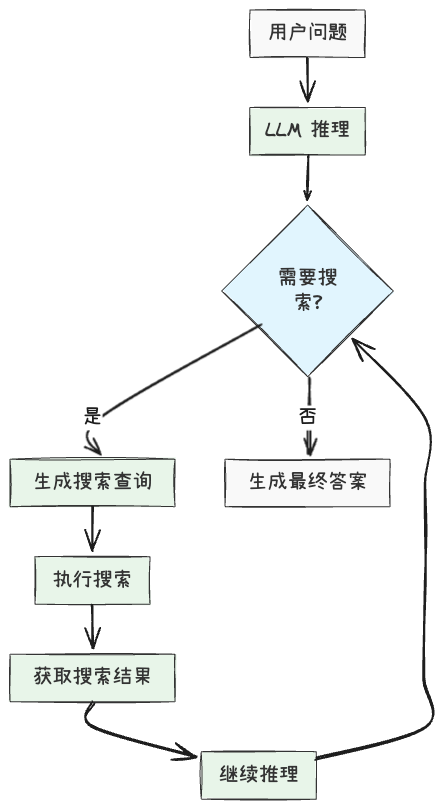

## 核心摘要

传统[RAG流水线]()通常按固定顺序执行检索、拼接和生成。本文把Agentic RAG解释为加入[检索策略控制器]()：模型可以根据中间结果决定是否改写查询、查看文件元数据、读取相邻片段、追加搜索或停止。

> **图片状态：** 7张原始图片引用全部解析；精选4张公开嵌入，覆盖传统RAG、工具循环、Chatbox流程和Search-R1；2张密集算法/轨迹截图与1张推广二维码共3张省略，无private分类。

## 固定流水线

来源把传统RAG拆成离线入库和在线问答：文档加载、切片、向量化与存储；查询时检索Top-K片段，拼成上下文再生成答案。

*固定流程简单、延迟可控，但首次检索不足时通常没有继续取证的反馈环。*

## 工具驱动的Agentic RAG

控制器把搜索和读取变成工具，并在Reason–Act–Observe循环中按需调用。关键变化不是模型名称，而是系统允许模型根据观察选择下一步，并以预算、权限和停止条件约束循环。

*模型在查询、工具结果和最终回答之间循环；自主性来自可选择动作和反馈。*

来源以Chatbox说明[先粗后细的证据检索]()：先找候选文件，查看元数据，再读取少量相关chunk和相邻上下文。

*流程图展示何时直接回答、何时继续调用文件检索与读取工具。图中文字较小，正文保留其机制摘要。*

## 从提示策略到学习策略

Search-R1尝试用强化学习学习何时搜索、搜索什么以及如何利用结果，即[搜索策略学习]()。结果奖励可以优化最终正确率，但还要防止检索成本失控、奖励投机和无来源回答。

*当模型生成搜索动作时调用搜索引擎，把结果放回推理轨迹，再决定继续搜索或回答。*

## 时间与实现边界

文中的LangChain/LangGraph导入路径、模型名称、Chatbox提交、Star数量和API写法是2025年的实现快照，不能作为2026年的安装指南。文章示例里还存在chunk编号笔误。

强化学习部分明确是简化伪代码：其中把生成放在`torch.no_grad()`下、用单步最大概率代替动作log probability，随后却对该值反向传播。这样的示意代码不能视为可运行训练实现；应以Search-R1论文和固定版本代码为准。

## 评价边界

Agentic RAG不必然优于固定RAG。多轮工具调用增加延迟、成本、非确定性与攻击面。应按问题复杂度路由：简单查询走固定检索，证据不足、多跳或需上下文扩展时才进入代理循环，并记录实际读取证据、工具轨迹和停止原因。

## 来源

- 袁超发，[《RAG进化之路：传统RAG到工具与强化学习双轮驱动的Agentic RAG》](https://yuanchaofa.com/post/from-native-rag-to-agentic-rag.html)，2025-10-03。
- Search-R1，arXiv:2503.09516。
