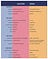

## Summary
Jennifer Brandel, Mara Zepeda, Astrid Scholz, and Aniyia Williams propose the "zebra" as an alternative to the venture-backed unicorn: a real, durable, capital-efficient company that pursues profit and social benefit together and cooperates with peers. They argue that business models shape company behavior and social outcomes, so founders need capital, legal structures, role models, and adoption support aligned with sustainable growth rather than rapid exits and shareholder return alone. The essay is a movement-building manifesto, not comparative evidence that zebra companies reliably outperform conventional startups.

## Key Claims
- Business models transmit incentives into company culture, strategy, user experience, and eventually social outcomes.
- Zebra companies seek profitability and social improvement together, favor endurance and capital efficiency, and become stronger through mutual support.
- Technology products alone do not solve institutional problems; adoption, deployment, measurement, and organizational process also require investment.
- Women and other underrepresented founders face large historical funding gaps even though the authors associate them with durable, mission-led company building.
- Purpose-and-profit companies struggle between nonprofit and conventional for-profit structures, while investors hesitate to fund models that cannot prove themselves without capital.
- Impact investment was, in the authors' 2017 account, too narrowly concentrated in a few accepted sectors to support fields such as journalism and education.
- A functioning zebra ecosystem requires aligned founders, investors, philanthropists, institutions, and peer networks rather than isolated company-level virtue.

## Key Quotes
> "The reality is that business models breed behavior" - the essay's central link between financing design and social consequence.

> "The problem isn't product, it's process." - a warning that institutional adoption and evaluation cannot be replaced by more software.

> "Zebra companies are both black and white: they are profitable and improve society." - the core definition of the zebra metaphor.

## Connections
- [[ZebrasUnite]] - the movement and publication organized around the essay's alternative startup model.
- [[ZebraCompanies]] - the proposed company archetype combining profit, purpose, endurance, and mutualism.
- [[MissionAlignedCapital]] - the funding and institutional infrastructure the authors argue zebra companies need.
- [[VentureCapitalFundStructure]] - the exit-oriented fund model whose incentives help explain the essay's criticism of unicorn finance.
- [[StartupCulture]] - one downstream layer through which the essay says business-model incentives become behavior.
- [[Facebook]] - cited as a case where platform scale and engagement incentives produced civic harm.
- [[Uber]] - cited as a case involving workplace, wage, political, and regulatory harms.

The surviving local chart is only 48 by 59 pixels. Its two-column comparison structure and contrasting color bands are visible, but the labels and detailed claims cannot be read reliably; the source's surrounding prose, rather than guessed chart text, grounds the summary above. The linked downloadable original now returns HTTP 404.

## Contradictions
- No direct contradiction identified. The essay adds a normative and social-outcome critique to [[VentureCapitalFundStructure]], but it does not dispute that fund's descriptive account of finite-life, exit-driven, power-law economics.
- The article's funding percentages, impact-investment market size, and performance comparisons are historical claims from 2017 and should not be read as current measurements.
